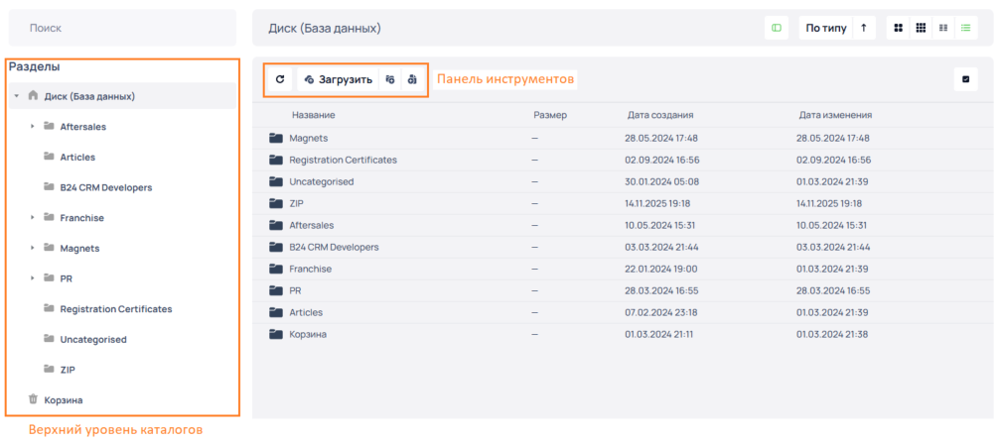
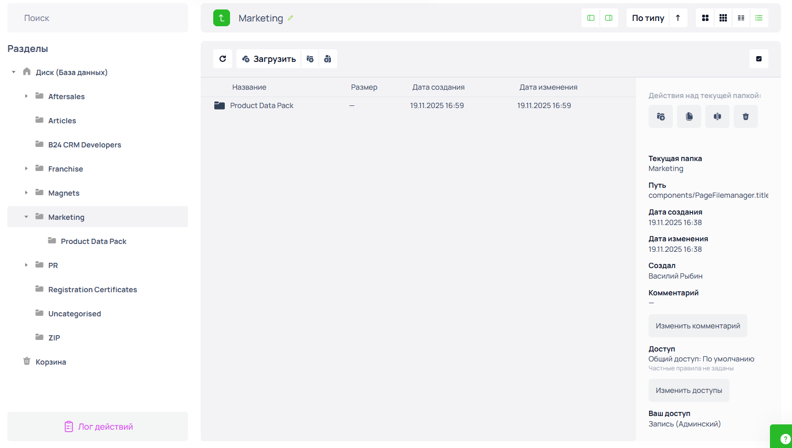

# Создание каталога в файловом менеджере

**Диск** — это специализированный раздел корпоративного портала, предназначенный для хранения данных, организованный с помощью файловой системы для структурированного управления доступами, файлами и каталогами.

Для перехода в раздел **Диск** в системном меню корпоративного портала перейдите по пунктам **Обучение и развитие** ➔ **Диск**.

### Создание раздела верхнего уровня

1. Перейдите в раздел корпортала **Диск**.
2. В меню **Разделы** выберите пункт **Диск (База данных)**.
3. На панели инструментов нажмите на иконку **Новая папка**. 
   :::tip[Обратите внимание]
      
Панель инструментов состоит из четырёх иконок:
<ul><li><strong>Обновить</strong></li><li><strong>Загрузить</strong></li><li><strong>Новая папка</strong></li><li><strong>Создать текстовый файл</strong></li></ul>
Для того чтобы посмотреть назначение иконки, наведите курсор на соответствующую иконку. Функция выбранной иконки отобразится в виде всплывающей подсказки.

   :::   
4. Введите название новой папки, для создания новой папки нажмите **Применить**, для отмены нажмите **Отмена**. 

   *Пример: **Marketing*** 

При успешном создании новой папки новая папка отобразится в верхнем уровне каталогов меню **Разделы**:

### Создание вложенных папок

1. Перейдите в раздел корпортала **Диск**.
2. В меню **Разделы** выберите папку в которой необходимо создать вложенность.
3. На панели инструментов нажмите на иконку **Новая папка**.
4. Введите название новой папки, для создания новой папки нажмите **Применить**, для отмены нажмите **Отмена**.\
   \
   &#x20;*Пример, создадим в папке **Marketing** вложенную папку* *с наименованием:* ***Product Data Pack***

При успешном создании вложенной папки вновь созданная папка отобразится в дереве папок меню **Раздела**:

