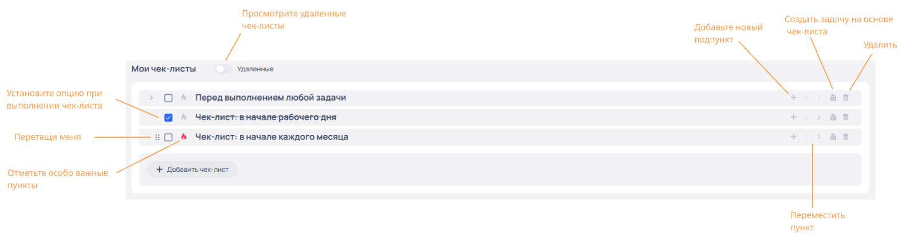

# Управление чек-листами

Раздел **Мои чек-листы** — это специальный раздел для ведения персональных чек-листов.

:::tip[Обратите внимание]
Доступ ко всем инструментам раздела доступен любому пользователю, авторизованному на корпортале.
:::

Для перехода в рабочую область раздела  **Мои чек-листы** в системном меню корпортала перейдите по пунктам меню **Задачи**➔**Мои чек-листы** или в правом верхнем углу корпортала нажмите на иконку пользователя (ваша иконка на корпоративном портале), после выберите пункт **Мои чек-листы**.

Все чек-листы пользователя отображаются в рабочей области раздела в виде списка в порядке заданным пользователем (ручная сортировка т.е. пользователь имеет возможность произвольно изменять порядок  чек-листов в списке).

## Как создать эффективный чек‑лист

1. **Определите цель** («Что я хочу получить в итоге?»).
2. **Разбейте на шаги** (от 3 до 15 пунктов — больше перегружает).
3. **Не создавайте глубокую вложенность подпунктов** (не более 2 уровней, любой «плоский» текст воспринимается проще, а на раскрытие подпунктов тратится дополнительное время).
4. **Формулируйте чётко** («Позвонить клиенту» лучше, чем «Связаться»).
5. **Добавьте контекст** (если нужно: время, место, ресурсы).
6. **Протестируйте** на одной задаче, скорректируйте структуру.
7. **Регулярно пересматривайте** (удаляйте устаревшее, добавляйте новое).

## &#x20;Панель инструментов раздела

Раздел **Мои чек-листы** имеет интуитивно понятную панель инструментов, что позволяет оперативно управлять жизненным циклом чек-листов.

:::tip[Обратите внимание]
При наведении курсора на любой значок интерфейса отобразится подсказка с назначением выбранного элемента.&#x20;
:::

## Создание чек-листа

1. Перейдите в раздел **Мои чек-листы**.
2. В рабочей области раздела нажмите **Добавить чек-лист**.
3. В поле ввода введите название чек-листа, чтобы сохранить название чек-листа, кликните на любое свободное место в рабочей области раздела либо добавьте подпункт нажав «+» (**Добавить подпункт**).
   :::tip[Обратите внимание]
   
<ul><li>Для создания нескольких пунктов чек-листа на одном уровне вложенности, после ввода названия чек-листа, нажмите клавишу <strong>Enter</strong>. Одно нажатие соответствует одному новому чек-листу. Нажмите <strong>Enter</strong> столько раз сколько необходимо. Для удаления вновь созданного чек-листа нажмите клавишу <strong>Backspace</strong>.</li><li>Для создания нескольких пунктов чек-листа на одном уровне вложенности с названием по умолчанию, просто нажмите клавишу <strong>Enter</strong>. Одно нажатие соответствует одному новому чек-листу. Нажмите <strong>Enter</strong> столько раз, сколько необходимо. Для удаления вновь созданного чек-листа нажмите клавишу <strong>Backspace</strong>.</li></ul>

   :::
При успешном создании вновь созданные чек-листы отобразятся в рабочей области раздела в виде списка.

## Редактирование чек-листа

1. Перейдите в раздел **Мои чек-листы**.
2. В списке чек-листов раздела найдите нужный чек-лист.
   :::tip[Обратите внимание]
   

Удалённые чек-листы недоступны для редактирования.

   :::
3. Для **редактирования названия** чек-листа нажмите на название в нужной записи, после введите новое название.\
   Для сохранения нового названия чек-листа кликните на любом свободном месте раздела.
4. Отредактируйте другие параметры чек-листов в соответствии с описанием панели инструментов раздела.

:::tip[Обратите внимание]
При наведении курсора на любой значок интерфейса отобразится подсказка с назначением выбранного элемента.&#x20;
:::

При успешном редактировании чек-листы с отредактированными параметрами отобразятся в рабочей области раздела в списке персональных чек-листов.&#x20;

## Удаление чек-листов

1. Перейдите в раздел **Мои чек-листы**.
2. В списке чек-листов раздела найдите нужный чек-лист, после нажмите на значок **«Корзина»**.
3. Для удаления чек-листа нажмите **Подтвердить**, для отмены нажмите **Отмена**.

При успешном удалении удалённые чек-листы исчезнут из списка персональных чек-листов раздела.&#x20;

## Восстановление чек-листа

1. Перейдите в раздел **Мои чек-листы**.
2. В рабочей области раздела установите переключатель **Удаленные**.
3. Из списка чек-листов найдите нужный чек-лист с пометкой **Удалено**, после нажмите на значок   **«Восстановить»**.

При успешном восстановлении восстановленный чек-лист отобразится в списке чек-листов раздела.

## Создание задачи на основе чек-листа

1. Перейдите в раздел **Мои чек-листы**.
2. В списке чек-листов раздела найдите нужный чек-лист, после нажмите на значок **«Создать задачу»**. 

   

   \
   Пользователь перенаправляется в форму **Создание задачи** в которой:

   1. Наименование задачи соответствует наименованию пункта чек-листа на основе которого была создана задача.
   2. В секции **Чек-листы** добавлены пункты чек-листа.
3. Заполните форму **Создание задачи** в соответствии с описанием раздела [Создать задачу](https://globaldrive.gitbook.io/cp/modules/tasks/sozdanie-i-redaktirovanie-zadachi), после заполнения формы нажмите **Сохранить**.

При успешном создании задачи пользователь получает системное сообщение `Задача добавлена` и перенаправляется на страницу вновь созданной задачи, при этом в рабочей области раздела **Мои чек-листы** у соответствующего чек-листа отображается значок с количеством созданных задач.

:::tip[Обратите внимание]
При удалении чек-листа, на основе которого была создана задача, чек-лист сохраняется в соответствующей задаче.
:::
